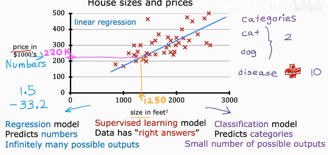

## 1、监督学习与无监督学习

| 对比维度 | 监督学习 | 无监督学习 |
| :--- | :--- | :--- |
| 训练数据 | 带标签数据：同时包含输入特征和对应的正确输出（标签） | 无标签数据：仅包含输入特征，没有预设的正确输出 |
| 核心目标 | 学习“输入→输出”的映射规律，对未知数据做出预测 | 挖掘数据内在的结构、分布规律与隐藏关联 |
| 典型任务 | 分类、回归 | 聚类、降维、关联规则挖掘、异常检测 |
| 常用算法 | 线性回归、逻辑回归、决策树、随机森林、SVM、CNN/RNN 等 | K-Means、层次聚类、PCA、t-SNE、Apriori、自编码器等 |
| 效果评估 | 有明确量化指标，如准确率、精确率、MSE、RMSE 等 | 无统一标准答案，依赖业务可解释性与间接评估指标 |
| 数据成本 | 标注成本高，高质量标签获取难度大 | 数据易获取，标注成本极低甚至为零 |
| 典型应用 | 垃圾邮件识别、房价预测、图像分类、语音识别 | 用户画像分群、商品关联推荐、异常交易检测、高维数据可视化 |

## 2、线性回归

（1）线性回归属于监督学习，因为它在训练的时候，既给定了输入特征，又给定了输入特征对应的正确输出。

- 回归模型
  > 可能存在多种情况的输出，比如学习时间（time）与学习成绩（score）的预测模型之中，
  > 那么我有可能需要知道Time=1、2、3、4、5、6等多种情况下的score。
- 分类模型
  > 存在的输出情况可能较少，假设动物分类器，用来区分猫和狗，那么它的输出仅仅只有猫和狗两种输出情况。

（2）公式

一元线性回归公式：

$$
\hat{y} = w x + b 
$$

> 权重*input+偏移，这样就可以得到预测数值pred_y，那么就引入了一个问题，如何确保`w`和`b`都是最优的呢？

损失函数 Cost Function：

- 损失函数-标量求和形式：
$$ 
J(\boldsymbol{\theta}) = \frac{1}{m} \sum_{i=1}^{m} \left( y_i - \hat{y}_i \right)^2 
$$
> 为了确保`w`和`b`都是最优的，那么需要通过某个数值来衡量当前的`w`和`b`是不是最优的？
>
> 【均方差损失函数】：通过计算“预测值”与“真实值”之间的误差，来衡量当前的`w`和`b`是否是最优的，将误差累积求和，求和结果越小，`w`和`b`越优。
- 损失函数-矩阵向量形式：
$$ 
J(\boldsymbol{\theta}) = \frac{1}{m} \left\| \boldsymbol{X}\boldsymbol{\theta} - \boldsymbol{y} \right\|_2^2 
$$

（3）损失函数的作用？

在训练集之中，找到“最优拟合曲线”。
