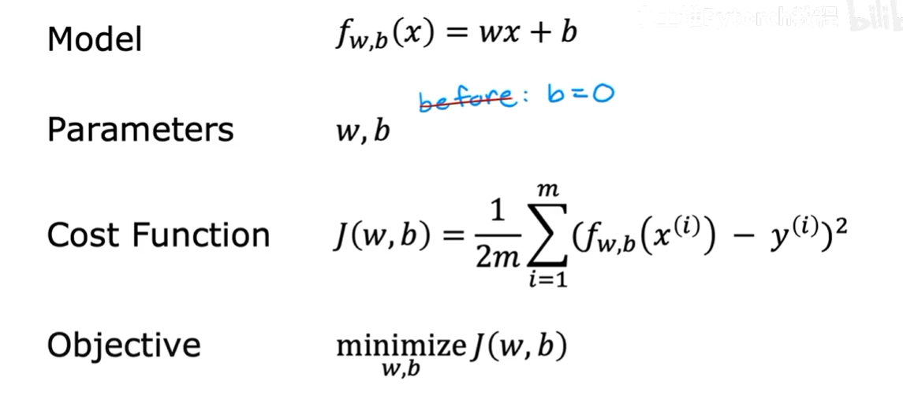
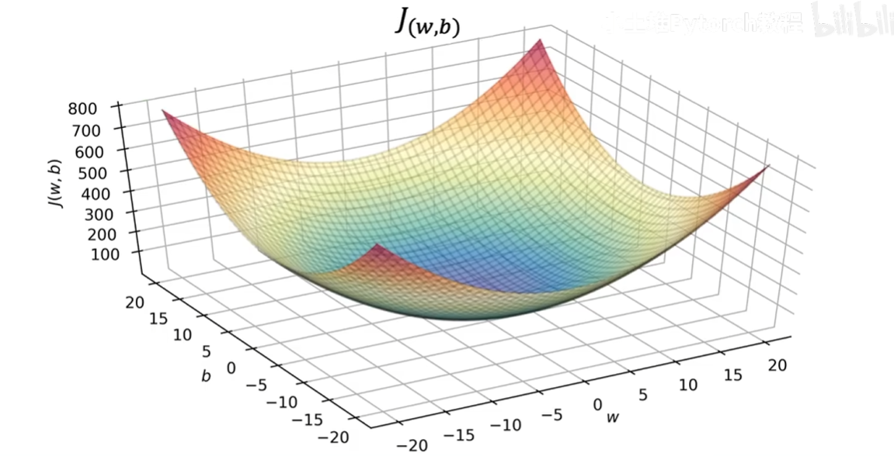
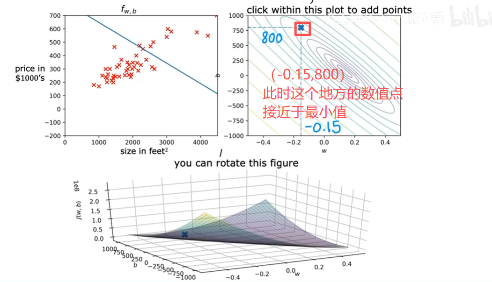
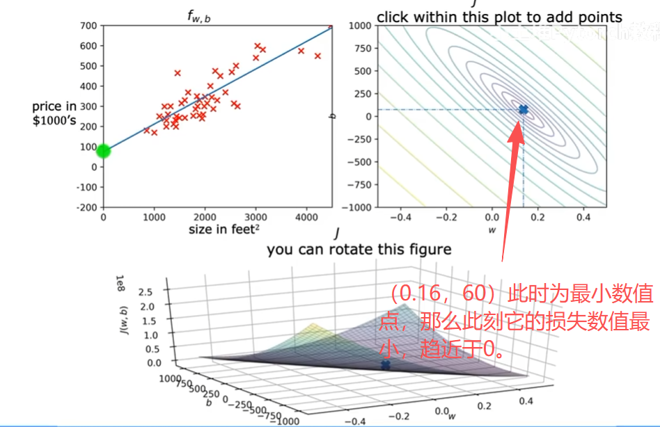

# day 002

> `../2022-Machine-Learning-Specialization-main/1-Supervised Machine Learning Regression and Classification/week1/4.Regression Model/`

## 1.可视化成本函数

### （1）成本函数模型的组成部分

常见示例图：

### （2）可视化示例

| 任意点 | 最小值点 |
| -------------- | --------------- |
|  |  |

可以看到第二张图所展示的损失数值已经趋近于0，那么也就意味着此时为最优点。

> 损失函数可视化代码："./C1_W1_Lab03_Cost_function_Soln.py"

但是在很多情况下，如果仅仅通过手动选择`w`和`b`来保证损失值变小，不合理。
在很多实际情况下，我们真正想要的情况是在模型迭代过程中，自动更新`w`和`b`，来确保损失值最终可以达到最小。

## 2.迭代优化算法

### （1）梯度下降法-简单介绍

> 这里以“线性回归模型”为例

> 梯度，对于三元标量函数 $f(x,y,z)$，其梯度 $\nabla f$ 是一个三维向量，由函数对各自变量的一阶偏导数组成，表达式为：
>
> $$
> \nabla f = \left( \frac{\partial f}{\partial x},\ \frac{\partial f}{\partial y},\ \frac{\partial f}{\partial z} \right)
> $$
> 
> 通常写作列向量形式：
> $$
> \nabla f = \begin{bmatrix}
> \dfrac{\partial f}{\partial x} \\[6pt]
> \dfrac{\partial f}{\partial y} \\[6pt]
> \dfrac{\partial f}{\partial z}
> \end{bmatrix}
> $$

> 梯度下降法可以快速迭代参数`w`和`b`。

> 梯度的几何意义指的是，函数在某一点，函数值上升最快的方向，
> 因此，梯度的反方向，就是函数值下降最快的方向。

那么，如果我想要保证损失值越来越小，也就是损失函数的`y`越来越小，既然“梯度”代表着损失值最快上升方向，那么“负梯度”就代表着损失值最快下降方向，所以只需要每次给“原先的参数w”，加上，“当前的负梯度”，就可以得到新的、最优的参数`w`。但是，如果仅仅给原本的权重参数加上“负梯度”，那么有可能会出现无法收敛等一些情况，那么此时就需要引入“学习率$\alpha$。”

- 损失值最快增大：$\nabla$Cost-Function
- 损失值最快减小：-$\nabla$Cost-Function
- 参数迭代公式：$\theta = \theta - \alpha · \nabla(\theta)$
  > $\alpha$：学习率，代表着权重在梯度方向上移动的距离
  >
  > $\nabla(\theta)$：梯度

### （2）梯度下降法-补充

梯度下降法能否带来全局最优解，主要是取决于“损失函数”，比如在线性回归模型之中，它的常见损失函数为均方差损失函数，均方差损失函数的图像是一个弧形，有且仅有一个最小值点，那么此时求得的最优点就是全局最优点。但是在大多数情况下，损失函数是极为复杂的，所以梯度下降法就可能带来一些“弊端”。

- 本质：
  > 梯度下降法智能保证收敛到梯度为0的驻点，无法保证找到全局最小数值，因为驻点可能是局部极小值，全局极小值，也可能是高维度场景之中常见的鞍点。
- 具体说明：
  > 1. **简单线性回归**（单特征）：模型形式为 $y = wx + b$，梯度下降会同时迭代更新**权重w**和**偏置b**两个参数，二者共同决定模型的拟合效果。
  >
  > 2. **多元线性回归**（多特征）：模型形式为 $y = w_1x_1 + w_2x_2 + ... + w_nx_n + b$，迭代对象是所有权重 $w_1,w_2...w_n$ 组成的权重向量，加上偏置b。
  >
  > 3. **统一表示**：在通用公式里，我们会把所有权重和偏置拼接成一个参数向量 $\theta$，也就是之前提到的迭代对象 $\theta$；在线性回归场景下，它的具体组成就是w和b。
- 弊端：
  > 参数震荡，无法收敛甚至发散。
  >
  > 收敛速度满，训练效率低。

