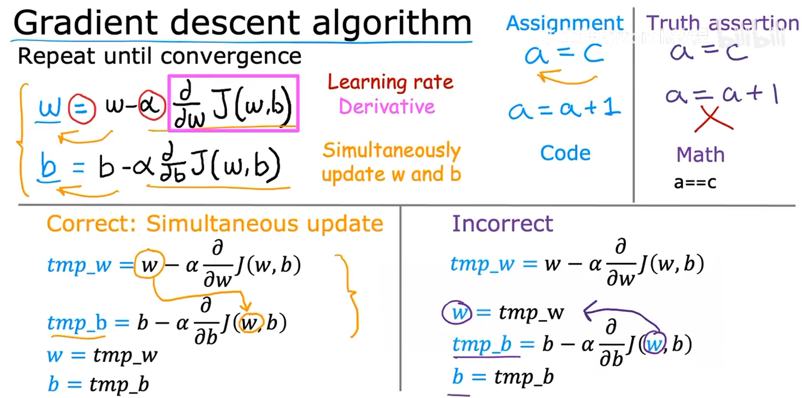
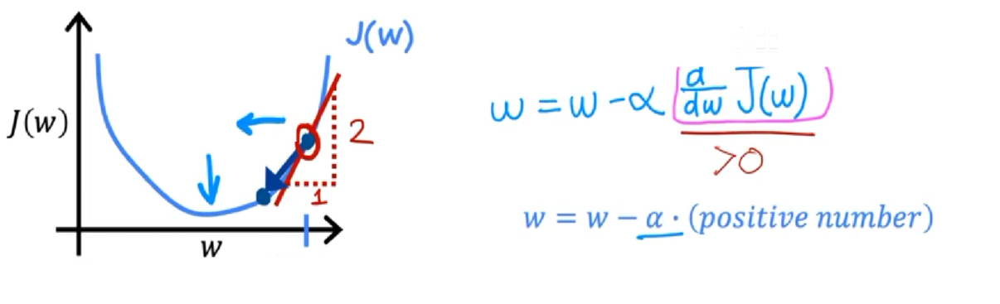
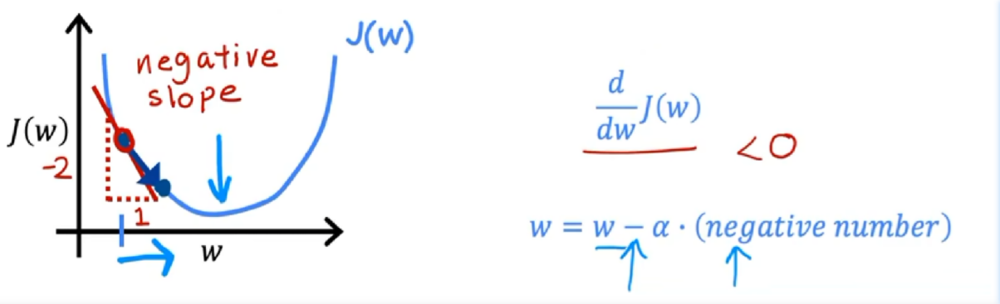
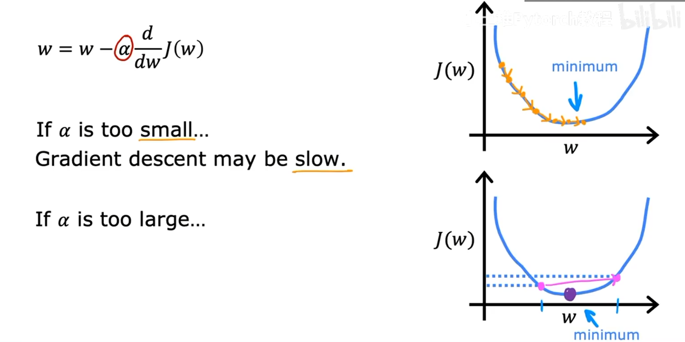
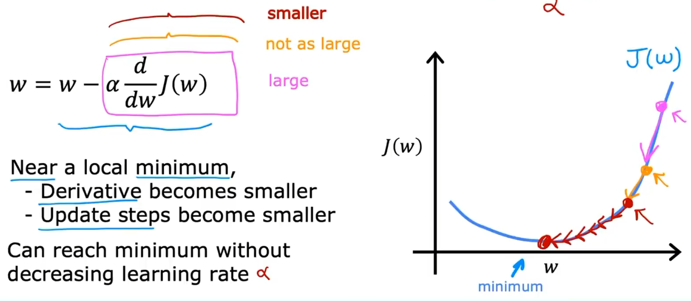
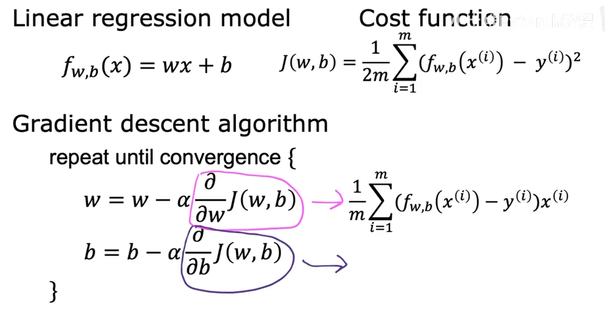

# day 003

- 梯度下降法公式解读
- 线性回归的梯度下降

## 1.梯度下降法公式解读

### （1）实现

### （2）$\frac{\partial J}{\partial w}$ 和 $\frac{\partial J}{\partial b}$ 解读

- 损失函数公式（以均方差损失函数为例）
> $$
> J(w,b) = \frac{1}{2m} \sum_{i=1}^m (w x_i + b - y_i)^2
> $$
- 参数`w`的更新过程：
> $$
> \frac{\partial J}{\partial w} = \frac{1}{m} \sum_{i=1}^m (w x_i + b - y_i) \cdot x_i
> $$
> $$
> w := w - \alpha \cdot \frac{\partial J}{\partial w}
> $$
- 参数`b`的更新过程：
> $$
> \frac{\partial J}{\partial b} = \frac{1}{m} \sum_{i=1}^m (w x_i + b - y_i)
> $$
> $$
> b := b - \alpha \cdot \frac{\partial J}{\partial b}
> $$

为什么通过这样的方式更新参数`w`和参数`b`，可以确保它们最终得到的结果是最优的。
| 正/负 | 示例图像 | Column3 |
| --------------- | --------------- | --------------- |
| 正 |  | 针对均方差损失函数，它的函数图像是一个弧形，有且仅存在一个驻点，梯度为正时，那么参数`w`每次会减去最大的梯度，`w`会沿着`x`轴负方向移动，逐渐趋近于最优`w` |
| 负 |  | 同理的，当梯度为负时，参数`w`每次会减去一个负数，也就是加上一个正数，`w`会沿着`x`轴正方向移动，逐渐趋近于最优`w` |

### （3）学习率 $\alpha$ 解读

首先，我想到为什么要添加“$\alpha$学习率”这个参数，这个参数的主要作用是什么？在添加了这个参数，当学习率$\alpha$过小，或者学习率$\alpha$过大时，会出现什么情况？

- 问题1：为什么要添加学习率α这个参数？
  > 不如先思考一下不添加的情况，假设不添加学习率，那么针对多种线性回归模型，它的`w`参数和`b`参数每次迭代的补偿都是固定的，这很明显不合理，添加学习率α的原因，可以这样思考：
  > 
  > - 数学方向：梯度下降的核心逻辑是基于函数的一阶泰勒展开近似：在当前参数点附近，用线性函数近似原损失函数，认为负梯度方向就是损失下降的方向。但这个线性近似只在当前点的极小邻域内才准确。如果步长过大，参数一步走出了这个邻域，线性近似就会失效，负梯度方向就不再保证损失下降，甚至可能让损失反而上升。学习率的作用就是把更新步长限制在 “一阶近似有效” 的局部范围内，确保每一次沿着负梯度方向更新，都能让损失函数朝着更小的方向前进。
  >
  > - 如果没有学习率（等价于($\alpha=1$)，直接用梯度本身作为步长），大梯度会导致参数一步跨过最优点，落到另一侧；下一步又会反向跨回来，形成永久震荡，永远无法收敛；若梯度本身量级更大，甚至会出现参数越走越远、损失持续上升的发散现象。
  >
  > 【总结】：学习率作为一个统一的缩放因子，可以灵活调整整体步长的量级，无需修改损失函数本身，就能适配不同规模、不同尺度的数据。
- 学习率过大或过小的情况
  > ① 学习率α过大，会导致参数`w`左右摇摆，甚至距离最优点越来越小
  >
  > ② 学习率α国小，会导致参数`w`趋近过慢，花费的时间过多
  >
  > 
  >
  > 

## 2.线性回归的梯度下降

