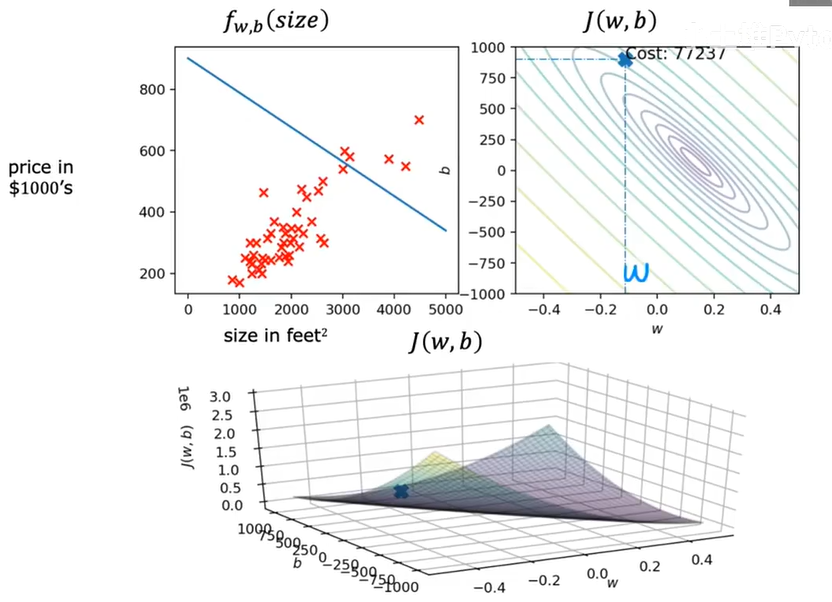
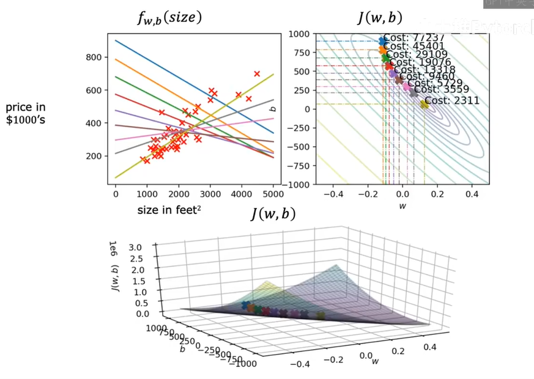

# Day 004

- 运行梯度下降法
- 多特征

## 1.运行梯度下降

> 【内容】：线性回归之中运行梯度下降会发生什么内容？

先看右上角的`j(w,b)`函数，假设取`w=-0.1`和`b=900`，将参数带入`f(w,b)`之中，可以得到：

$$
f(x) = -0.1x + 900
$$

通过梯度变化不断迭代`w`和`b`，可以看到线性回归线正在不断趋近于最佳（黄色），如下图所示：

## 2.多特征

先看上面的公式，在暂时忽略偏移值`b`的情况下，只存在一个权重`w`，
但是在很多情况下，就算是最普通的线性回归模型，都会存在多个权重wi，
假设在一个简单的购房模型之中，可能影响房价`f(w,b)`的可能参数为“面积”、“地区”、“楼层”等一些参数，
针对三个不同参数，都有其对应的权重`w_i`，这就引入了“多特征”。

像这样的公式：

$$
f_{w,b}(x) = w_1 x_1 + w_2 x_2 + \dots + w_n x_n + b
$$

但是可以看到，当在模型函数之中，权重参数`w`过多时，计算起来是十分不方便的，所以需要引入向量：

$$
% 核心线性模型公式
f_{\vec{w},b}(\vec{x}) = \vec{w} \cdot \vec{x} + b
$$

公式解读：

- 将所有的权重放置到一个“权重向量”之中：

$$
% 权重向量定义
\vec{w} = \left[ w_1 \quad w_2 \quad w_3 \quad \dots \quad w_n \right]
$$

- 将所有的输入放置到一个“输入向量”之中：

$$
\text{vector } \vec{x} = \left[ x_1 \quad x_2 \quad x_3 \quad \dots \quad x_n \right]
$$

- 偏移量`b`作为一个标量而存在：

$$
% 文字说明
b \text{ is a number}
$$
