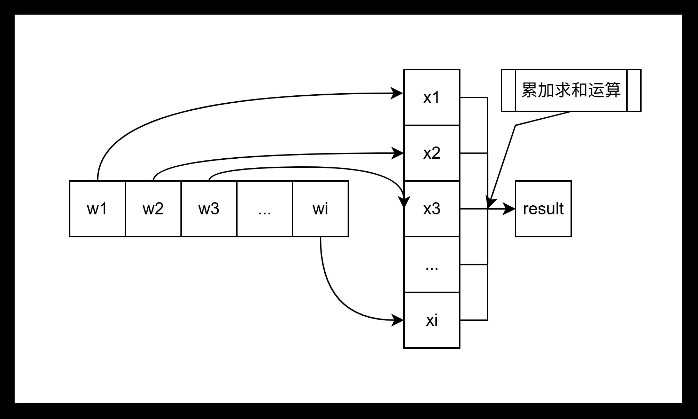
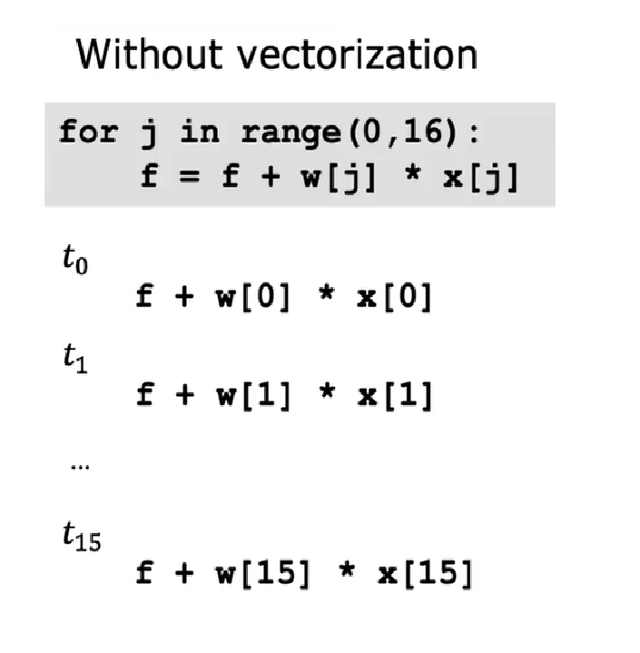
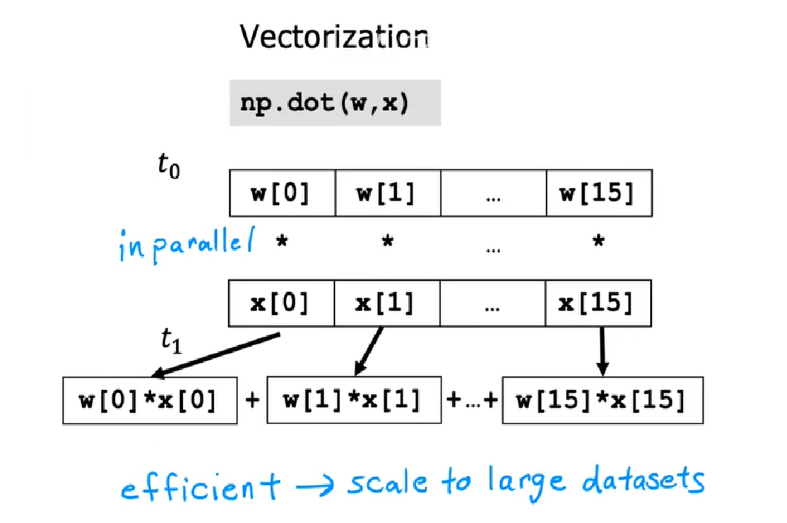

# Day 005

- 向量化
- 多重线性回归的梯度下降
- 特征缩放
- 如何判断梯度下降是否收敛

## 1.向量化

> 矩阵相乘



将参数矩阵化之后，可以看到更加便于进行数学计算，差不多就是下面这个过程：

$$
f_{\overrightarrow{w},b}(\overrightarrow{x}) = \overrightarrow{w} \cdot \overrightarrow{x} + b
$$

> <font color="red">从现在开始的`w`和`b`不仅仅是一个标量，而是一个向量。</font>

$\overrightarrow{w}$：所有权重`w`的集合向量。

$\overrightarrow{x}$：所有输入`x`的集合向量。

并行计算方式：
```python
import numpy as np
f_result=np.dot(w,x)+b
```

|  计算方式  | 计算过程   |
| ---        | ---        |
| 无向量计算 |  |
| 向量计算   |    |

## 2.多重线性回归的梯度下降

> 多重线性回归梯度下降 = 凸损失函数 + 负梯度方向 + 同步参数更新 + 特征缩放加速，最终目标是快速找到全局最优的回归系数组合。

收敛判定：

迭代停止的标准：当损失函数$J(\boldsymbol{\theta})$的下降幅度小于一个极小阈值（如$10^{-6}$）时，认为参数已逼近最优解，可停止迭代。

- 【特征缩放】：
  > 不同特征量纲差异极大（比如年龄 0-100，年收入 0-100 万），会让损失函数的等高线变成 “狭长椭圆”，梯度下降走 “之字形” 锯齿路线，收敛极慢。
- 注意事项：
  > 主要是为了将所有特征值收敛到同一相近尺度，训练集缩放结束后，预训练新数据集时，也需要使用相同的缩放尺度。

## 3.特征缩放

### （1）<font color="red">为什么要进行特征缩放？</font>

个人理解：<font color="blue">首先，需要明确的是，假设a的数值是b的1000倍，那么损失函数对a的梯度也会是b的1000倍左右。其次，学习率`α`是固定的，那么它对大尺度特征可能步长太大，会出现来回震荡的情况，难以收敛，甚至损失值可能出现越来越大的情况，针对小尺度特征可能步长太小，会出现收敛及慢的情况，那么在不进行特征缩放的情况下，难以找到一个匹配所有特征值的学习率`α`。</font>

所以需要进行“特征缩放”操作。

### （2）<font color="red">怎么缩放？缩放之后有什么好处？有什么坏处？</font>

- 最小最大归一化（Min-Max Scaling）
  > 根据最小值和最大值，将特征值压缩到固定区间之中，比如说`[0,1]`之间、`[-1,1]`之间。
  >
  > 【缩放过程】：
  > 假设当前最大值为$\max$，最小值为$\min$，当前输入为$x_j$，缩放之后为$x_j'$，那么缩放公式为：
  >
  > $$
  > x_j' = \frac{x_j - \min}{\max - \min}
  > $$
  >
  > 【特点】：
  >
  > 好处：可以保留原始数据的比例关系，单纯的线性映射，
  >
  > 坏处：假设存在一个异常值为10000，其余值都在100之下，那么这个异常值就可能导出把所有数据都压缩到极小区间之内。
  >
- 标准化（Z-Score Standardization）
  > 将特征值转化为均值为0，标准差为1的分布，那么缩放公式为：
  > $$
  > x_j' = \frac{x_j - \mu_j}{\sigma_j}
  > $$
  >
  > 其中$\mu_j$是第`j`个特征的均值，$\sigma_j$表示第`j`个特征的标准差。
  >
  > 【特点】：
  > 
  > 不限制数据的数值范围，仅仅<font color="red">统一数据的中心和离散程度</font>，对异常值的敏感远远低于归一化，鲁棒性更强。
  > 
  > 注：鲁棒性是指系统在面对内部结构变化或外部干扰时，仍能保持稳定运行和功能有效性的能力。
  >
  > 

> <font color="red">注意：两种方法都是逐特征独立计算参数，每个特征用自己的均值 / 极值做缩放，特征之间互不影响。</font>

## 4.如何判断梯度下降是否收敛？

- 损失下降阈值法：
  > 判断对象：损失值，也就是$f_{w,b}(x)$。
  >
  > 计算相邻的两次损失值的绝对差值$\left| J(\theta_{k+1}) - J(\theta_{k}) \right|$小于预设的最小阈值$\epsilon$，即判定为收敛。
  >
  > 缺点：难以找到一个合适的阈值。
- 参数更新幅度法：
  > 判断对象：参数，也就是$w$和$b$参数。
  >
  > 直接监控参数的变化量，计算参数向量更新后的差值$\left| w_{i+1} - w_{i} \right|$，当差值小于阈值时，说明参数已停止有效更新，默认达到收敛条件。
  >
- 损失曲线观测法：
  > 判断对象：x轴为迭代次数，y轴为损失值。
  >
  > 判断损失值是否随着迭代次数逐渐趋近于平缓，如果逐渐趋近于平缓，或者接近于直线，那么就默认达到了收敛条件。
- 固定迭代次数发：
  > 判断对象：有效迭代次数和损失值变化情况。
  >
  > 预先设定最大迭代次数，观测在有效迭代次数之内的损失值变化情况。 
