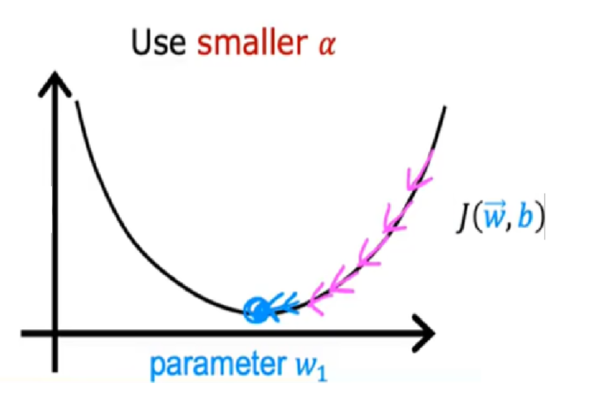
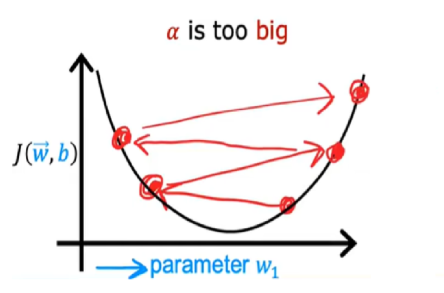
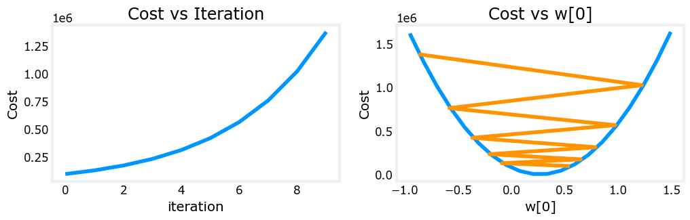
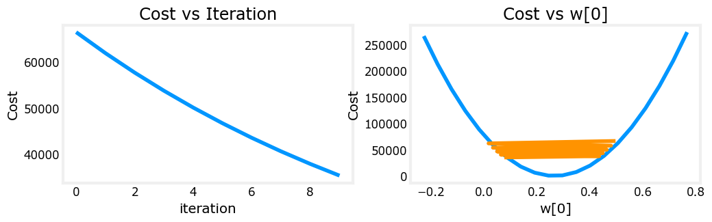
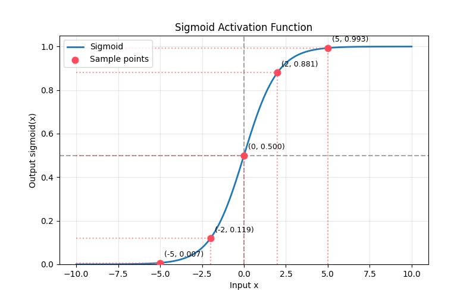
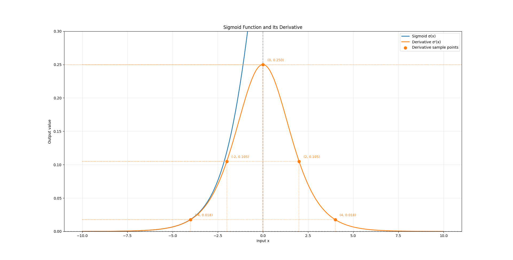
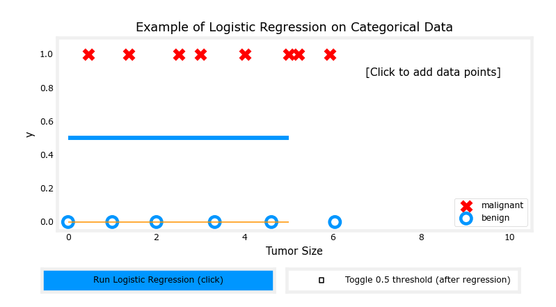

# Day 006

- 学习率的选择
- 特征工程
- 多项式回归
- 逻辑回归

## 1.选择学习率

| 学习率 | 图像 | 结论 |
| --------------- | --------------- | --------------- |
| 学习率过小 |  | 可能会耗费过多的训练时间 |
| 学习率过大 |  | 可能会导致损失值越来越大 |

学习率过大：

学习率过小：

## 2.特征工程

> 建立模型的时候，针对某一个预测对象，它可能存在多个特征对象，那么应该如何选择特征？

| 模块 | 核心目标 | 核心方法 | 关键要点 |
| :--- | :--- | :--- | :--- |
| **特征清洗** | 保障数据基础质量，消除残缺、异常与噪声 | 缺失值删除/填充/缺失标记；3σ、IQR法识别并处理异常值 | 偏态数据优先用中位数填充；业务真实异常需保留，仅修正数据错误 |
| **特征编码** | 将类别、文本等非数值特征转为模型可计算的数值 | 独热编码、序数编码、目标编码 | 线性模型禁用无序特征的纯标签编码；树模型对编码限制极少 |
| **特征变换与缩放** | 统一特征量纲、优化数据分布，适配模型数学假设 | 标准化、归一化；对数/Box-Cox变换；分箱离散化 | 梯度下降、距离类模型必做缩放；树模型完全不需要特征缩放 |
| **特征衍生与构建** | 基于业务放大有效信号，提升模型表达上限 | 统计聚合、特征交叉、业务规则衍生、时序滑窗特征 | 以业务逻辑为核心，盲目组合会导致维度爆炸与过拟合 |
| **特征选择** | 剔除冗余与噪声，精简特征集，缓解过拟合 | 过滤法、包裹法、嵌入法 | 嵌入法（L1正则、树模型特征重要性）工业界最常用，平衡效率与效果 |

## 3.多项式回归

属于广义线性回归，并非真正的非线性模型。通过构造原始特征的高次幂、交叉项作为新特征，将非线性拟合问题转化为线性回归问题求解，模型对回归参数保持线性。

将$x, x^2, x^3…$等多项式项视作独立特征，直接复用线性回归的最小二乘法或梯度下降进行参数估计。

（最多3阶）多项式阶数$d$。阶数过低会欠拟合，无法捕捉数据的非线性规律；阶数过高会严重过拟合，过度拟合数据噪声，泛化能力骤降。

- 必须做特征缩放：高次项会急剧放大特征量纲差异，不缩放会导致梯度下降收敛极慢甚至发散。
- 必须搭配正则化：高阶多项式过拟合风险极高，通过L1/L2正则约束系数大小，是保障泛化能力的关键。

## 4.逻辑回归

### 4.1.【概念】：

经典二分类线性模型，虽然名字包含“回归”二字，但实际却用于分类任务，核心思想主要是将线性回归的连续输出通过`Sigmoid`函数映射为0~1之间的概率值，以此实现类别判定。

### 4.2.【映射方式】：

主要映射实现方式为`Sigmoid`激活函数，函数公式为：

$$
\sigma(x) = \frac{1}{1 + e^{-x}}
$$

将任意输入`x`压缩到（0，1）区间，可以看作“样本为正”的概率，函数图像为：

导函数图像为：

> 相对于均方差损失函数而言，采用对数似然损失（凸函数），存在全局唯一最优解，可以通过梯度下降法稳定求解，本质是最大化样本真实四类1的概率乘积。

### 4.3.【拓展】：

- 多分类：拓展为`softmax`回归（多元逻辑回归）；
- 过拟合防护：搭配`L1/L2`正则化；
- 局限：仅能拟合线性决策边界，非线性场景需配合特征工程，对多重共线性敏感。（？）

### 4.4.【0或1输出的核心】：

> 阈值判断

在逻辑回归的分类流程之中，`Sigmoid`输出概率之后，会通过一个固定阈值做二分类判定，一般情况下，这个固定阈值被设置为0.5，那么也就意味着：

$$
y_{pred}=
\begin{cases}
1, & \sigma(x) \ge 0.5 \\
0, & \sigma(x) < 0.5
\end{cases}
$$

> 比如:
>
> 输入`x=2`，`Sigmoid`输出约为0.881，判定为1；
>
> 输入`x=-2`，`Sigmoid`输出约为0.119，判定为0；

