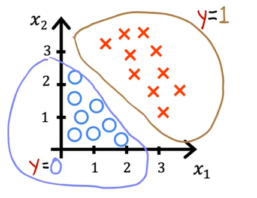
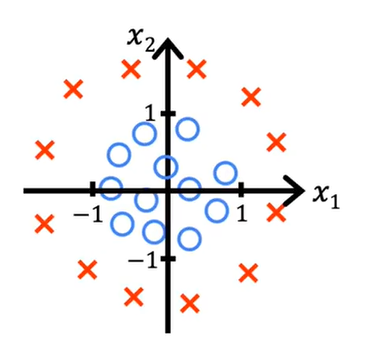
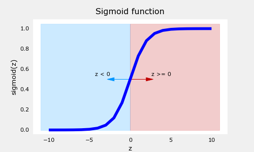
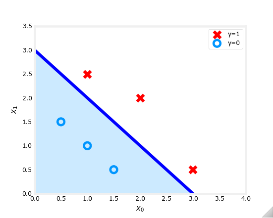
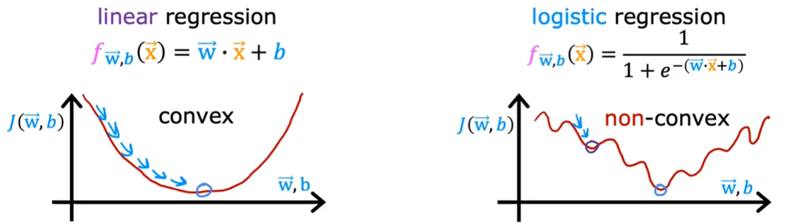
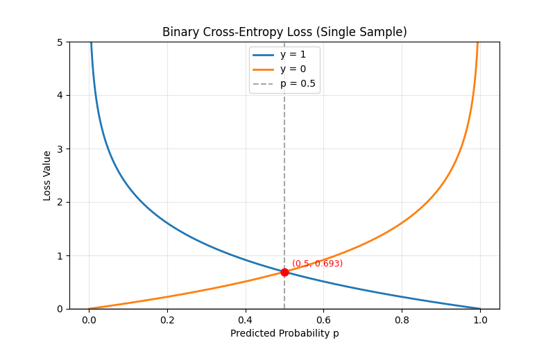
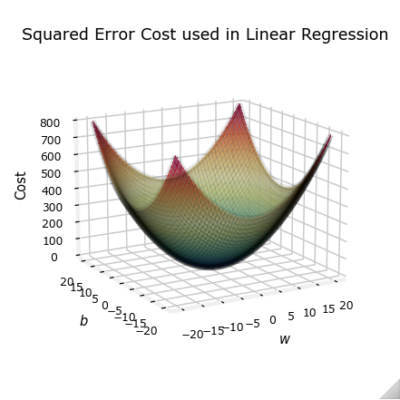
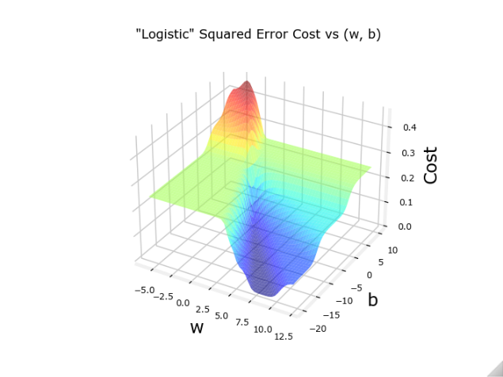

# Day 007

- 决策边界
- 逻辑回归的损失函数
- 逻辑回归之中的梯度下降实现

## 1.决策边界

> 什么是决策边界？决策边界对于模型的输出，存在什么影响？

### 1.1.前置-激活函数

$$
z = \overrightarrow{w} \cdot \overrightarrow{x} + b
$$

$$
\downarrow_{\text{带入}z}
$$

$$
g(z) = \frac{1}{1+e^{-z}}
$$

$$
\Downarrow{联合}
$$

$$
f_{\overrightarrow{w},b}(\overrightarrow{x}) = g\left(\underbrace{\overrightarrow{w} \cdot \overrightarrow{x} + b}_{z}\right) = \frac{1}{1 + e^{-(\overrightarrow{w} \cdot \overrightarrow{x} + b)}}
$$

比如在`Sigmoid`激活函数之中，通常将0.5作为决策边界，大于0.5的情况默认为1，小于0.5的情况默认为0，此时0.5就被称为决策边界。

### 1.2.决策边界示例

线性决策边界：

非线性决策边界：

### 1.3.决策边界

按照我的理解，决策边界其实就是在分类任务之中，用来划分不同的预测类别的分界线。比如在二维空间之中，可以是直线，也可以是曲线，三维空间之中可以是直面，也可以是曲面，在更高维空间中，应该就是“超平面”。

> 说人话，就是划分了输出结果集。

| 示例图 | 图像 |
| --- | --- |
| 示例图-1 |  |
| 示例图-2 |  |

## 2.逻辑回归的损失函数

> 逻辑回归的流程：
>
> 等于是将线性回归的预测值，作为sigmoid激活函数的输入，然后判断sigmoid激活函数的输出是否小于分解值。

> Linear regression
> $$
> f_{\overrightarrow{w},b}(\overrightarrow{x}) = \overrightarrow{w} \cdot \overrightarrow{x} + b
> $$
>
> Logistic regression
> $$
> f_{\overrightarrow{w},b}(\overrightarrow{x}) = \frac{1}{1 + e^{-(\overrightarrow{w} \cdot \overrightarrow{x} + b)}}
> $$

逻辑回归的标准损失函数是“对数似然损失（二元交叉熵损失函数）”，放弃了线性回归的均方差损失函数，主要是因为均方差损失函数在逻辑回归之中是非凸函数，无法保证在梯度下降的过程中找到全局最优解。

### 2.1.区别

> 非凸性：将 Sigmoid 函数代入 MSE 后，损失函数关于参数$\boldsymbol{\theta}$是非凸函数，存在多个局部极小值，梯度下降容易陷入局部最优，无法保证全局最优。
>
> 梯度消失：Sigmoid 在正负两端进入饱和区时，导数值趋近于 0；MSE 对参数的梯度包含 Sigmoid 导数项，会导致参数更新几乎停滞，收敛极慢。

### 2.2.损失函数

【原函数公式】：

$$
J(\theta) = -\frac{1}{m}\sum_{i=1}^{m}\left[ y^{(i)}\log(p^{(i)}) + (1-y^{(i)})\log(1-p^{(i)}) \right]
$$

【损失函数公式】：

$$
\frac{\partial J}{\partial \theta_j} = \frac{1}{m}\sum_{i=1}^{m} \left( p^{(i)} - y^{(i)} \right) x_j^{(i)}
$$

> 仅将线性回归的预测值$\hat{y}$替换为 Sigmoid 输出的概率$p$，可直接复用梯度下降框架求解。

- $m$: 训练集样本总数

- $y^{(i)}$: 第 $i$ 个样本真实标签，仅取值 $0$ 或 $1$

- $p^{(i)}$: 第 $i$ 个样本预测为正类的概率，$p^{(i)} = g(\overrightarrow{w} \cdot \overrightarrow{x}^{(i)} + b)$，即 Sigmoid 输出

- $\theta$: 模型参数集合 $\{\overrightarrow{w}, b\}$

## 3.逻辑回归之中的梯度下降实现

### 3.1.损失函数等公式

【损失函数公式】：

$$
J(\overrightarrow{w}, b) = -\frac{1}{m}\sum_{i=1}^{m}\left[ y^{(i)}\log\left(f_{\overrightarrow{w},b}\left(\overrightarrow{x}^{(i)}\right)\right) + (1-y^{(i)})\log\left(1-f_{\overrightarrow{w},b}\left(\overrightarrow{x}^{(i)}\right)\right) \right]
$$

【$w_j$和$b$公式】：

$$
w_j = w_j - \alpha \frac{\partial}{\partial w_j} J(\overrightarrow{w}, b)
$$
$$
b = b - \alpha \frac{\partial}{\partial b} J(\overrightarrow{w}, b)
$$

### 3.2.【损失函数对导数的梯度公式】：

$$
\frac{\partial}{\partial w_j} J(\overrightarrow{w}, b) = \frac{1}{m}\sum_{i=1}^{m} \left( f_{\overrightarrow{w},b}\left(\overrightarrow{x}^{(i)}\right) - y^{(i)} \right) x_j^{(i)}
$$

$$
\frac{\partial}{\partial b} J(\overrightarrow{w}, b) = \frac{1}{m}\sum_{i=1}^{m} \left( f_{\overrightarrow{w},b}\left(\overrightarrow{x}^{(i)}\right) - y^{(i)} \right)
$$

### 3.3.图像补充

线性回归之中使用均方差损失曲面图：

逻辑回归之中误用均方差损失曲面图：

