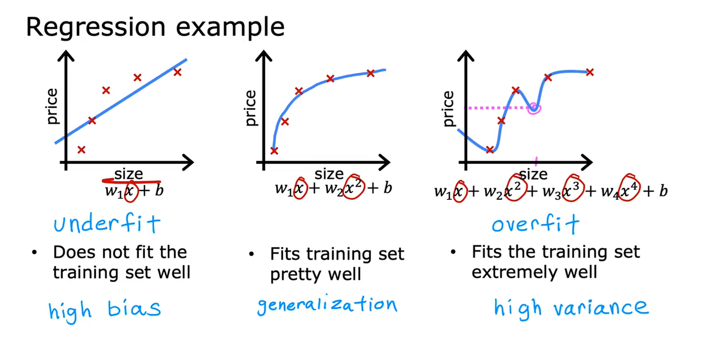
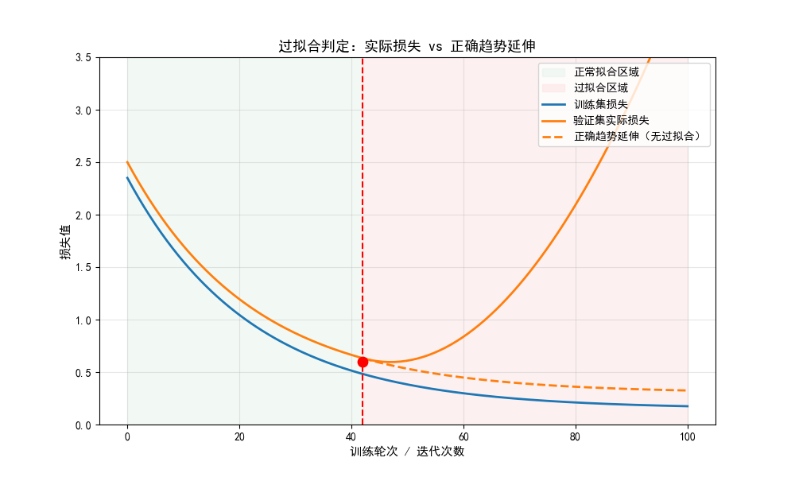
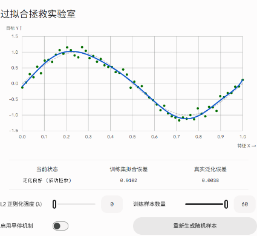
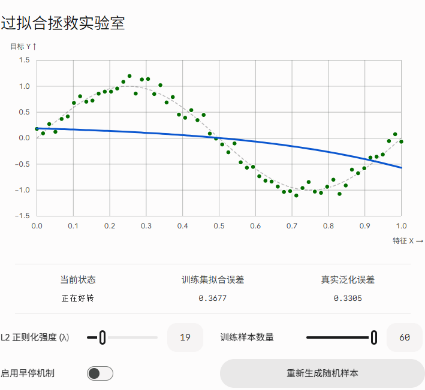

# Day 008

## 1.过拟合

> 什么是过拟合？
>
> 如何避免过拟合？

### 1.1.概念

> 训练集效果很好，测试集效果很差

按照我的理解，就是模型在训练的时候，将一些噪声（不具有泛型的特征）当成了数据集的泛型特征，最终会呈现出“训练效果很好，测试集/新数据的泛化能力大幅度下降”的现象。

### 1.2.原因

模型复杂度 > 数据真实规律的复杂度

- 模型容量过高：如多项式阶数过大、神经网络参数过多、决策树无限制生长；

- 训练数据缺陷：样本总量不足、数据代表性差、噪声占比高，模型极易从噪声中拟合出虚假规律；

- 训练过度：迭代轮次过多，模型从 “学习通用规律” 逐渐转向 “记忆样本细节”；

- 特征质量差：冗余、噪声特征过多，模型学到了特征与标签之间的偶然关联。

### 1.3.区别

欠拟合：

模型复杂度不足，连训练集的规律都没学好，训练集和测试集效果都很差。

过拟合：

模型复杂度过高，训练集效果极好，但测试集效果很差。

## 2.如何解决过拟合？

### 2.1.数据层面

说人话，就是多给一点数据，对数据进行二次清洗，去掉影响模型学习的噪声数据。

### 2.2.模型层面

说人话就是降低模型复杂度，可以进行正则化，还有最后一种，就是使用“随机失活”这个方法。

【注】：

> 正则化：
>
> - `L1`正则化：把不重要的特征权值$w_i$直接设置为0，那么它的$w_i·x$项直接就是0。
>
> - `L2`正则化（权重衰减）：把所有特征的权重$w_i$都变得极小，从而避免噪声特征对模型训练的影响，让拟合出来的曲线变得很平滑，个人感觉不是很好。
>
> 随机失活：
>
> 在每次迭代模型时，随机让一定比例的神经元临时停止学习，强迫每个节点都要扛起识别全局特征的责任。

【补充】：

| 序号 | `L2`正则化强度 | 展示图 |
| --------------- | --------------- | --------------- |
| 1 | 0 |  |
| 2 | 19 |  |

### 2.3.训练与机制层面

最直接但最麻烦的方式就是查看损失值的实时变化，如果出现问题，就赶快改就行。

还有一种方式，就是k折交叉验证，把数据集分为k份，然后轮流拿出一份作为验证，剩下的作为训练，以此来进行训练，（这种方式其实也适用于数据集较少的情况下）。

集成学习，得到多个容易过拟合的决策树的输出结果，然后对所有的输出结果进行求和取平均处理。

## 3.带正则化的损失函数

### 3.1.骨架（其实不是很明白）

$$
\mathcal{L}_{\text{total}} = \mathcal{L}_{\text{data}}(y, \hat{y}) + \lambda \cdot \Omega(\theta)
$$

经验风险（左项）：负责“拼命做对”，去拟合训练集里的每一个数据点。

结构风险（右项）：负责“保持克制”，惩罚过大的权重参数 $\theta$，压制模型的死记硬背能力。

超参数 $\lambda$ 的调控哲学：理解 $\lambda$ 调大与调小分别是在向哪一端妥协，以及工程上如何通过交叉验证寻找它的黄金平衡点。

### 3.2.$L_1$和$L_2$正则化

必须对比掌握两大核心主力：

（1）$L_2$ 正则化（Ridge 回归 / 权重衰减 Weight Decay）惩罚项：

$$
\Omega(\theta) = \|\theta\|_2^2 = \sum w_i^2
$$

核心表现：平滑收缩（Shrinkage）。

（2）强迫参数无限趋近于 0，但绝不等于 0。$L_1$ 正则化（Lasso 回归）惩罚项：

$$
\Omega(\theta) = \|\theta\|_1 = \sum |w_i|
$$

核心表现：稀疏化（Sparsity）。能直接将次要特征的权重强行削为 0，自带特征选择功能。

（3）ElasticNet（弹性网络）：

学习 $L_1 + L_2$ 的混合态，理解它在应对“高维、输入特征之间高度相关”时的折中优势。

## 4.正则化的线性回归

本质：在普通最小二乘（OLS）损失中加入参数范数惩罚项，约束参数幅值以缩小估计方差，以可接受的偏差上升换取方差大幅下降，最终降低泛化误差，同时解决过拟合与多重共线性问题。

> 动因：OLS 参数估计在特征多重共线性、特征维度高于样本量时，参数方差急剧膨胀、数值极不稳定，甚至出现无穷多解；正则化通过引入凸惩罚将病态问题转为良态，得到稳定且泛化性更优的参数估计。

### 4.1.【损失函数】：

$$
J(\vec{w}, b) = \frac{1}{2m} \sum_{i=1}^{m} \left( f_{\vec{w},b}(\vec{x}^{(i)}) - y^{(i)} \right)^2 + \frac{\lambda}{2m} \sum_{j=1}^{n} w_j^2
$$

### 4.2.【梯度公式】:

$$
\frac{\partial J(\vec{w}, b)}{\partial w_j} = \frac{1}{m} \sum_{i=1}^{m} \left( f_{\vec{w},b}(\vec{x}^{(i)}) - y^{(i)} \right) x_j^{(i)} + \frac{\lambda}{m} w_j
$$

$$
\frac{\partial J(\vec{w}, b)}{\partial b} = \frac{1}{m} \sum_{i=1}^{m} \left( f_{\vec{w},b}(\vec{x}^{(i)}) - y^{(i)} \right)
$$

### 4.3.【更新迭代公式】：

$$
w_j := w_j - \alpha \left[ \frac{1}{m} \sum_{i=1}^{m} \left( f_{\vec{w},b}(\vec{x}^{(i)}) - y^{(i)} \right) x_j^{(i)} + \frac{\lambda}{m} w_j \right]
$$

$$
b := b - \alpha \frac{1}{m} \sum_{i=1}^{m} \left( f_{\vec{w},b}(\vec{x}^{(i)}) - y^{(i)} \right)
$$

## 5.正则化的逻辑回归

### 5.1.核心

在标准逻辑回归的对数似然损失中加入参数范数惩罚项，通过约束参数幅值降低模型有效复杂度，缓解过拟合，提升泛化能力。

> 动因：逻辑回归为线性分类器，当特征维度高、存在多重共线性、训练样本不足时，参数易过度拟合训练噪声，出现数值膨胀，导致决策边界扭曲、泛化性能下降。

感觉，说人话，就是倾尽一切手段去提高模型泛化能力。

### 5.2.公式

$$
J(\overrightarrow{w}, b) = -\frac{1}{m}\sum_{i=1}^{m}\left[ y^{(i)}\log\left(f_{\overrightarrow{w},b}\left(\overrightarrow{x}^{(i)}\right)\right) + (1-y^{(i)})\log\left(1-f_{\overrightarrow{w},b}\left(\overrightarrow{x}^{(i)}\right)\right) \right] + \frac{\lambda}{2n}\sum_{j=1}^{n} w_j^2
$$

> PS：其实我并不是很明白这边的公式，感觉乖乖的，可能是我的数学能力没跟上。

### 5.3.弹性网

同时使用$L_1$和$L_2$正则化，通过调节比例系数来平衡。

按照我的理解，之所以这样做，是因为$L_1$正则化主要会（随机）将部分特征的权重设置为0，但是假设当前特征高度相关，那么在进行$L_1$正则化之后，就可能导致选择结果不稳定、容易选取单个特征的缺陷，那么就需要想办法将损失曲线变得平滑一点，那么就需要引入$L_2$正则化。

