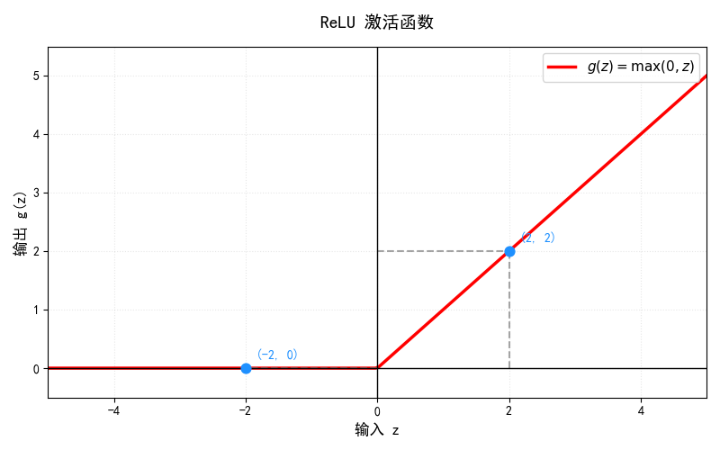
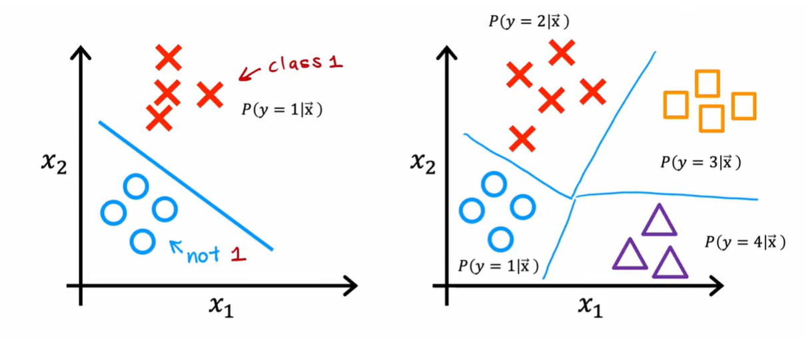
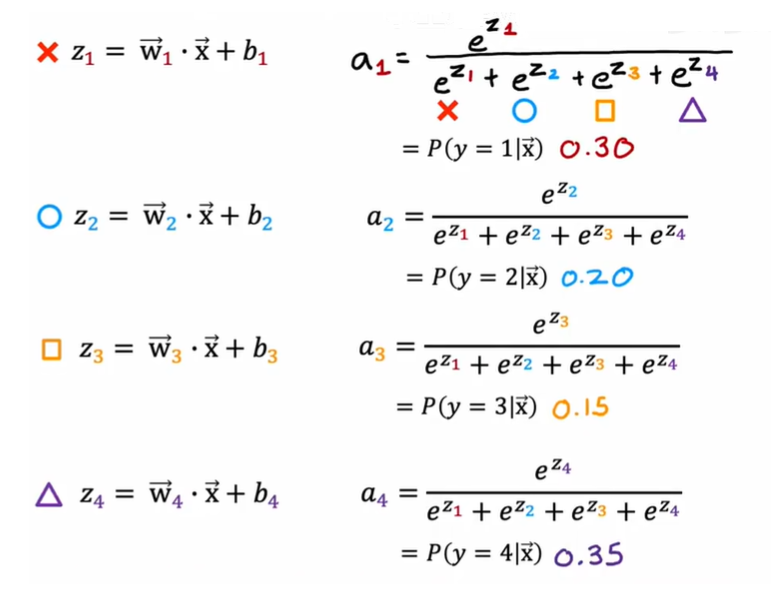
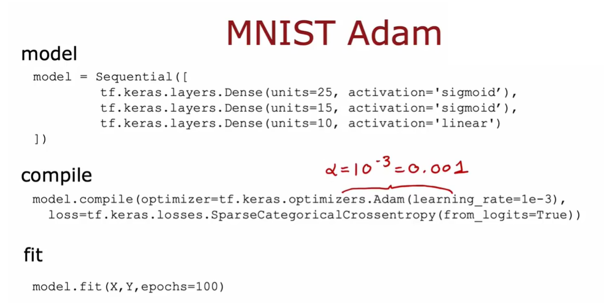
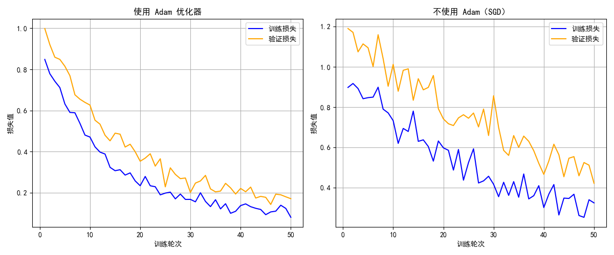

# Day 010

## 1.`ReLU`激活函数

$$
g(z) = \max(0, z)
$$

分段表达：

$$
g(z)=
\begin{cases}
0, & z < 0 \\
z, & z \ge 0
\end{cases}
$$

主要应用于隐藏层的激活函数，能够有效缓解梯度消失问题。

## 2.多类别

## 3.`Softmax`激活函数

函数公式：

$$
\sigma(\boldsymbol{z})_i = \frac{e^{z_i}}{\sum_{j=1}^{K} e^{z_j}} \quad , \quad i=1,2,\dots,K
$$

> 核心约束：所有类别输出概率之和恒等于 1，即
>
> $$
> \sum_{i=1}^{K} \sigma(\boldsymbol{z})_i = 1
> $$

示例图：

## 4.不同激活函数之间的区别

| 激活函数 | 核心应用层级 | 典型任务 | 核心作用 |
|----------|--------------|----------|----------|
| Sigmoid | 二分类输出层、循环网络门控 | 二分类、LSTM/GRU 门控机制 | 输出单类别概率、控制信息流通比例 |
| ReLU | 深度网络隐藏层（绝对主力） | 图像分类、NLP 预训练、各类深度网络 | 引入非线性、缓解梯度消失、加速训练 |
| Softmax | 多分类输出层、注意力层 | 多类别分类、Transformer 自注意力 | 多类别概率归一化、注意力权重归一化 |

## 5.带有`softmax`的多分类交叉熵损失函数

[main.py](./main.py)

## 6.高级优化

### 6.1.Adam 优化器

> Adam 全称为 Adaptive Moment Estimation（自适应矩估计），
> 它的作用是在反向传播得到梯度后，基于梯度的历史信息自适应调整每个参数的学习率，
> 从而高效更新网络权重。它结合了动量法（维护梯度一阶矩的指数移动平均，
> 积累梯度方向的惯性）与 RMSProp 算法
> （维护梯度二阶矩的指数移动平均，适配不同参数的更新幅度）的优势，
> 并加入偏差修正来抵消训练初期矩估计的偏移问题，
> 兼具收敛速度快、对超参数鲁棒性好、训练稳定性强的特点，
> 是绝大多数深度学习任务的默认优化器选择。

### 6.2.什么是导数？

导数是描述函数在某一点处的变化率的概念。它表示函数输出值相对于输入值的变化率，即函数在该点的斜率。导数可以帮助我们理解函数的行为，尤其是在优化问题中，它用于确定如何调整参数以最小化损失函数。

