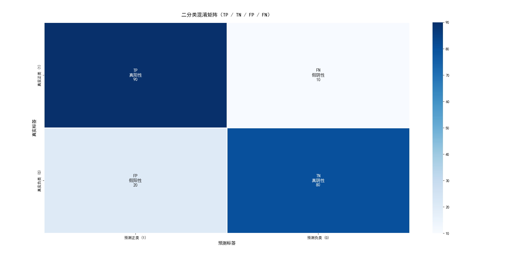

# Day 011

## 1.求导

[main1.py](./main1.py)

## 2.下一步尝试

- 评估模型
- 改进算法

## 3.模型评估

### 3.1.数据集类型

- 训练集：
  > 用来训练模型，学习数据中的模式和规律。
- 验证集：
  > 用来在训练过程之中调整模型超参数和进行模型选择，相当于模拟考。
- 测试集：
  > 仅在模型训练和调优全部完成之后使用一次，用于最终评估模型的泛化性能。

### 3.2.划分策略

- 留出法
  > 直接将数据集按一定比例（如7:3或8:2）划分为训练集和测试集。
  >
  > 评估结果受到随机划分情况的影响。
- 交叉验证法
  > 将数据集分成K份，轮流用其中K-1份训练，剩余1份验证，重复K次后取平均结果。
  >
  > 计算开销极大
- 自助法
  > 从数据集中有放回地抽取样本作为训练集，未被抽到的作为测试集。
  >
  > 在小数据集上效果较好，但会引入估计偏差。

### 3.3.分类任务-核心评价指标

- TP (True Positive)：真正例
  > 模型预测为正，且预测正确
- TN (True Negative)：真负例
  > 模型预测为负，且预测错误
- FP (False Positive)：假正例（Ⅰ 型错误）
  > 模型预测为正，且预测错误
- FN (False Negative)：假负例（Ⅱ 型错误）
  > 模型预测为负，且预测错误

准确率 (Accuracy)：(TP+TN) / (TP+TN+FP+FN)。最直观的指标，但在数据不平衡时（如99%是负样本）会失效。

精确率 (Precision)：TP / (TP+FP)。衡量“模型认为是正例的样本中，有多少是真的正例”，侧重查准。适用于垃圾邮件过滤等场景。

召回率 (Recall)：TP / (TP+FN)。衡量“所有真正的正例中，模型找回了多少”，侧重查全。适用于疾病筛查等场景。

F1分数 (调和平均数F1-Score)：2 * (Precision * Recall) / (Precision + Recall)。精确率和召回率的调和平均数，在两者之间寻求平衡。

ROC曲线与AUC：ROC曲线通过变化阈值，描绘真正例率 (TPR) 与假正例率 (FPR) 的关系。AUC是曲线下的面积，值越大（最大为1），表明模型的整体分类性能越好。

### 3.4.回归任务-核心评价指标

- 均方误差
  > 衡量预测值与真实值之间误差平方的平均值。
- 平均绝对误差
  > 衡量预测值与真实值之间绝对误差的平均值。

### 3.5.其它任务

【生成任务】：

如图像生成常用Inception Score (IS) 和 Fréchet Inception Distance (FID)。

【文本生成】：

常用BLEU和ROUGE等指标来评估生成文本与参考文本的相似度。

## 4.基准性能水平

- 看这个学习模式是否比人的学习损失更小
- 与相似的竞争算法相比较
