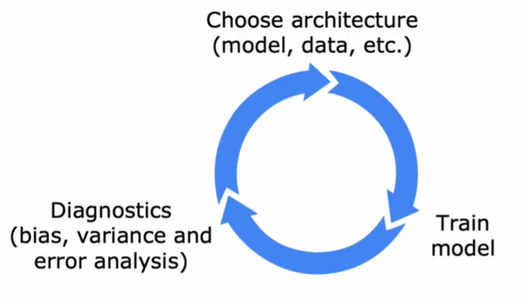

# 学习曲线

## 1.偏差、方差和神经网络

### 1.1.核心概念

$$
总误差 = 偏差² + 方差 + 噪声
$$

其中，偏差指的是模型预测的平均值和真实值之间的差距，它衡量的是模型的整体准确度。

方差，指的是模型在不同训练集之上预测结果的波动程度，它衡量的是模型的精确度或准确度。

噪声，指的是数据本身固有的、不可减少的误差。

### 1.2.权衡

在传统机器学习中，偏差和方差是一对必须小心权衡的矛盾。模型复杂度是调节它们的关键：

模型过于简单 → 高偏差，低方差。

> 因为模型“学不动”，无论数据怎么变，它的预测都稳定地偏离目标。

模型过于复杂 → 低偏差，高方差。

> 因为模型“学得太细”，完美记住了训练数据的每一个细节，导致对新数据的微小变化极度敏感。

因此，传统观念认为，存在一个“恰到好处”的模型复杂度，能实现偏差和方差的最佳平衡，使总误差最小。

### 1.3.对应关系

- 高偏差（欠拟合）：
  > 诊断：训练集误差远高于预期水平（如人类水平）。
  >
  > 策略：最直接有效的方法是增大网络规模（增加层数或神经元数）。
  > 也可以尝试延长训练时间或使用更复杂的模型架构。
- 高方差（过拟合）：
  > 诊断：训练集误差很低，但验证集误差远高于训练集误差。
  >
  > 策略：最有效的方法是获取更多数据。
  > 如果无法获得更多数据，则使用正则化技术（如L1/L2正则化、Dropout、数据增强）或
  > 早停法（Early Stopping）。

## 2.机器学习的开发迭代过程

## 3.增加数据

> 对抗过拟合，提升泛化能力，突破数据瓶颈。

【基础数据增强方法】：

- 几何变换
- 颜色/光度变换
- 噪声注入与模糊
- 局部擦除

【高级与自动化数据增强方法】：

- 混合增强 (Mixup/CutMix)：将两张或多张图像按一定比例混合，并生成对应的混合标签。
- 自动化增强 (AutoAugment)：使用强化学习或网格搜索等方法，自动从数据中学习最优的增强策略组合。
- 基于神经网络的增强：利用生成对抗网络（GAN） 或扩散模型（Diffusion Model） 生成与真实数据高度相似的、语义一致的新样本。

