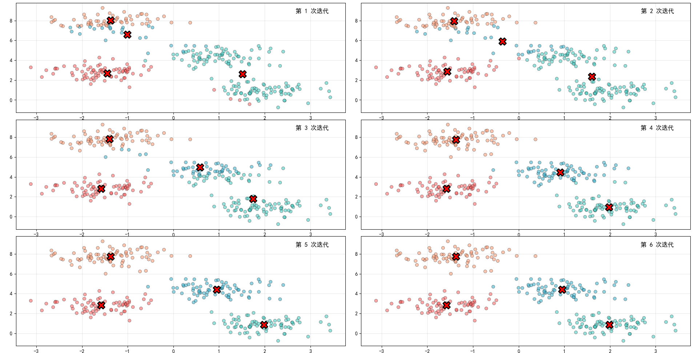
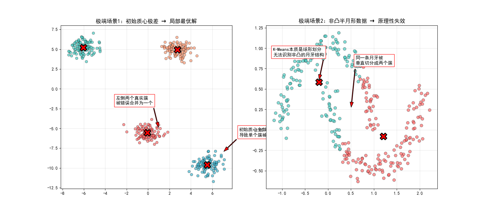
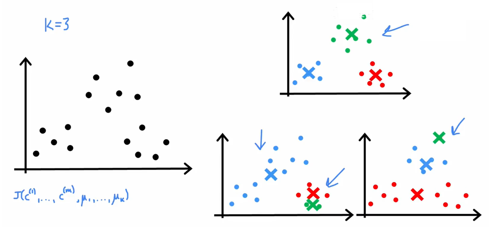
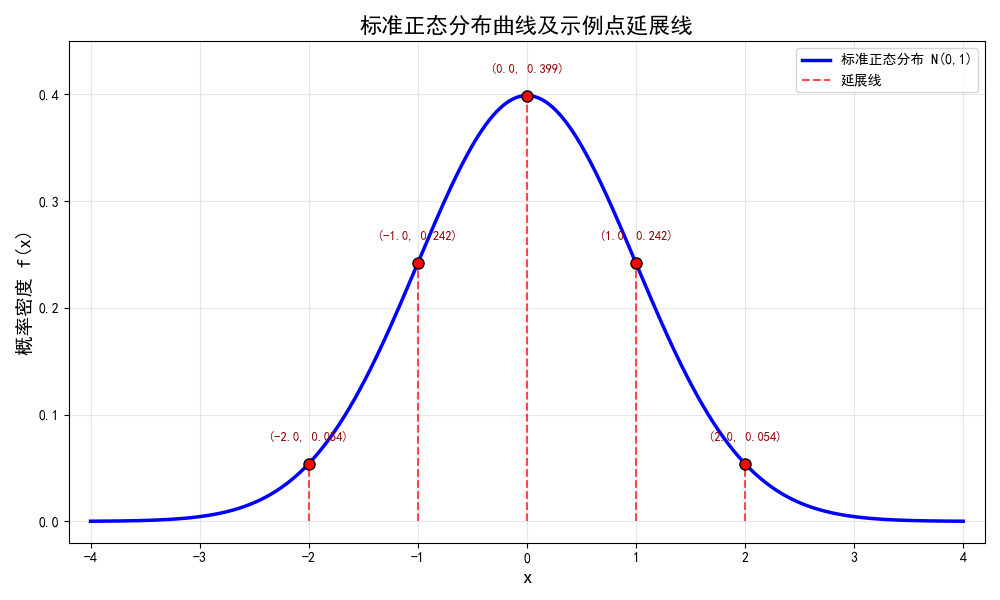
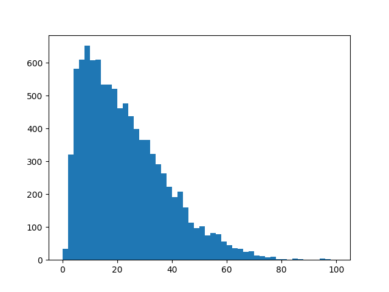
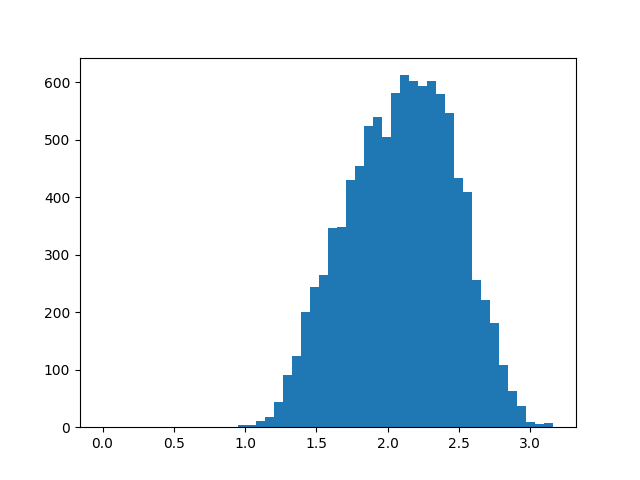
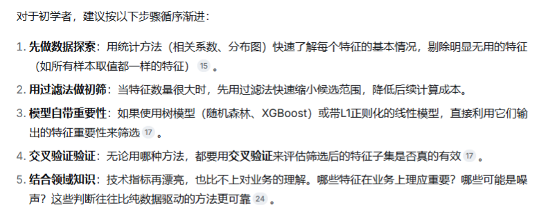

# Day 015

## 1.`K-Means`算法

### 1.1.计算公式

K-Means 的优化目标可以概括为一句话：**最小化所有样本到其所属簇质心的距离平方和**。

这个目标函数被称为 **SSE（Sum of Squared Errors，误差平方和）** ：

$$
SSE = \sum_{i=1}^{K} \sum_{x \in C_i} \|x - \mu_i\|^2
$$

其中 $\mu_i$ 是第 $i$ 个簇的质心。直观理解就是：**每个样本离自己簇的“中心”越近越好。**





### 1.2.`K`均值



进行多次尝试，只需要确保损失函数$J$最小就行。

### 1.3.聚类数量

| 方法 | 核心指标 | 选择标准 | 客观性 | 计算成本 |
|------|----------|----------|--------|----------|
| **肘部法则** | SSE / WCSS | 曲线拐点 | 低（肉眼判断）| 低 |
| **轮廓系数** | 平均轮廓系数 | 取最大值 | 高 | 中等 |
| **Gap统计量** | Gap值 | 取最大值 | 最高 | 高 |
| **业务经验** | 领域知识 | 业务判断 | 最低 | 最低 |

> **补充说明**：SSE（Sum of Squared Errors）与 WCSS（Within-Cluster Sum of Squares）本质上是同一概念，均表示每个样本点到其所属簇质心的距离平方和。在不同的库或文献中可能使用不同的缩写，含义完全一致。

## 2.高斯正态分布

高斯分布之所以无处不在，核心原因在于**中心极限定理（Central Limit Theorem）** ：

<font color="red">大量独立随机变量的和，无论它们各自服从什么分布，其总和都会趋近于正态分布。这解释了为何人的身高、血压、测量误差等众多自然与社会科学现象都近似服从正态分布。</font>

高斯分布完全由两个参数决定：

| 参数 | 符号 | 含义 |
|------|------|------|
| **均值（Mean）** | **μ** | 决定分布曲线的**中心位置**（峰值所在处） |
| **标准差（Standard Deviation）** | **σ** | 决定分布曲线的**宽度或离散程度**（σ越大，曲线越矮胖） |

一个随机变量 $X$ 若服从高斯分布，记为 $X \sim \mathcal{N}(\mu, \sigma^2)$。其**概率密度函数（PDF）** 为：

$$
f(x) = \frac{1}{\sigma\sqrt{2\pi}} \exp\left(-\frac{(x-\mu)^2}{2\sigma^2}\right)
$$

当均值 $\mu = 0$、标准差 $\sigma = 1$ 时，称为**标准正态分布**，记为 $\mathcal{N}(0, 1)$。



## 3.特征选择

<font color="red">在特征选择时，先查看特征的直方图，如果不符合高斯分布，那么可以对其进行“分布变换”，如下图：</font>

【未调和之前的数据分布】：



【调和之后的数据分布】：

> ```python
> plt.hist(x**0.25,bins=50)
> plt.savefig("./save_2.png")
> ```



> 【补充】：
>
> 
>
> 【特征的选择过程】：
>
> 

## 4.二进制标签


