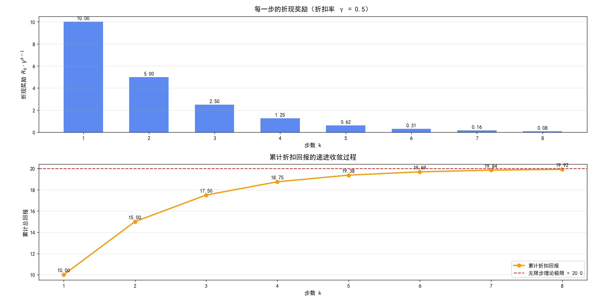
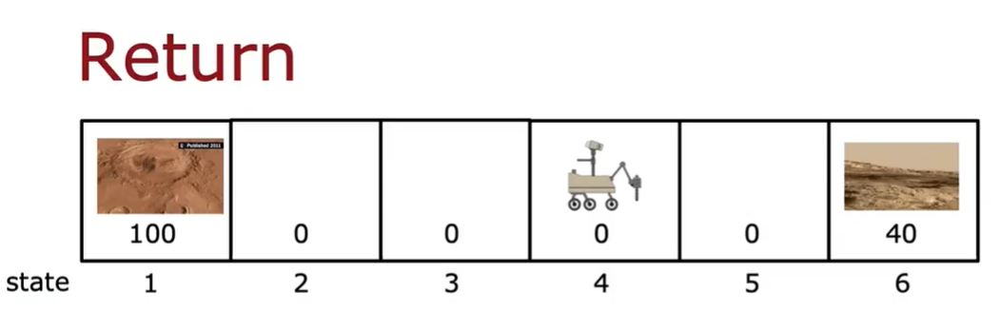
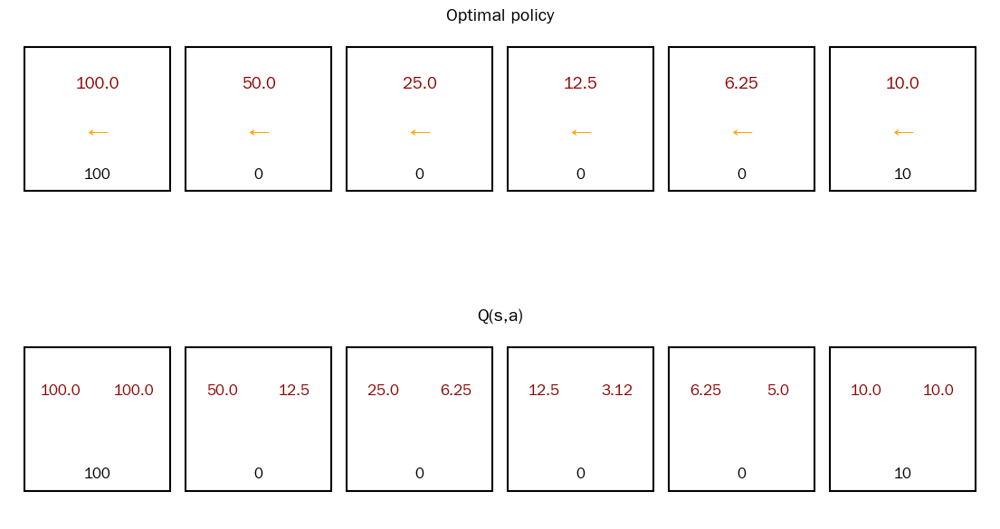

# Day 016

## 1.推荐系统

几乎每一个检索系统都可以被划分为“检索 & 排序”这两步。

检索阶段的话，主要是将当前电影映射到向量空间之中，得到向量 $V_1$ ，然后再计算 $V_1$ 与 $V_i$（其余电影映射结果） 之间的余弦相似度，将所得结果放置到一个列表 $list$ 之中，然后再对所有结果进行去重处理。

排序阶段的话，对所有结果的集合 $list$ 进行排序操作。

## 2.强化学习

### 2.1.理论

强化学习（Reinforcement Learning, RL）是机器学习的三大核心范式之一，与监督学习、无监督学习并列。它的核心目标是让一个**智能体（Agent）** 通过与环境（Environment）的持续交互，**自主学会在动态环境中做出一系列最优决策**，以最大化其获得的**长期累积奖励**。

如果说监督学习是在教模型"该输出什么"（根据标签学习映射），那么强化学习则是在教模型"该做什么"（在环境中通过行动学习策略）。它关注的不是单个输入的正确答案，而是一个更真实的问题：当模型身处一个动态、不确定的环境时，如何通过"试错"获得最大的长期回报。

一个标准的强化学习问题由以下五个核心部分组成：

| 核心要素 | 含义 | 举例（训练小狗） |
|----------|------|------------------|
| **智能体（Agent）** | 学习和决策的主体，即"谁"在做决策 | 小狗 |
| **环境（Environment）** | 智能体与之交互的外部世界 | 整个房间 |
| **状态（State）** | 智能体在某一时刻对环境的主观感知 | "小狗在客厅的角落" |
| **动作（Action）** | 智能体基于当前状态可以执行的所有可能操作 | "走到地毯中央"、"蹲下" |
| **奖励（Reward）** | 环境对智能体所执行动作的即时反馈信号（可正可负） | 做对了给零食，做错了给"不" |

强化学习问题通常可以用**马尔可夫决策过程（Markov Decision Process, MDP）** 来精确描述。一个 MDP 可以定义为一个五元组 $(S, A, P, R, \gamma)$：

- **$S$**：状态集合（State Space）
- **$A$**：动作集合（Action Space）
- **$P$**：状态转移概率，表示在状态 $s$ 下执行动作 $a$ 后，转移到状态 $s'$ 的概率
- **$R$**：奖励函数，表示在状态 $s$ 下执行动作 $a$ 能获得的即时奖励
- **$\gamma$**：折扣因子（介于 0 和 1 之间），用于平衡**眼前奖励**和**未来奖励**的重要性

> 告诉模型，怎么做是“好”，怎么做是“不好”？
>
> 针对“好”的情况，可以给模型一个正向奖励+1。
>
> 针对“不好”的情况，可以给模型一个负向奖励-1。

### 2.1.强化学习中的回报

$$
\begin{cases}
Q(s, a) = \text{Return if you} \\
\quad \bullet\ \ \text{start in state } s. \\
\quad \bullet\ \ \text{take action } a \text{ (once)}. \\
\quad \bullet\ \ \text{then behave optimally after that}.
\end{cases}
\quad\quad s \rightarrow s'
$$

$$
\begin{align*}
Q(s, a) &= R_1 + \gamma\left[R_2 + \gamma R_3 + \gamma^2 R_4 + \gamma^3 R_5 + \cdots\right] \\
&= R_1 + \gamma\left[R_2 + \gamma\left(R_3 + \gamma R_4 + \gamma^2 R_5 + \gamma^3 R_6 + \cdots\right)\right] \\
&= R_1 + \gamma\left[R_2 + \gamma\left(R_3 + \gamma\left(R_4 + \gamma R_5 + \gamma^2 R_6 + \cdots\right)\right)\right] \\
&= R_1 + \gamma R_2 + \gamma^2 R_3 + \gamma^3 R_4 + \gamma^4 R_5 + \gamma^5 R_6 + \cdots \\
&= \sum_{k=0}^{\infty} \gamma^k \cdot R_{k+1}
\end{align*}
$$

【折扣奖励和步数之间的关系】：

【简单示例图】：

## 3.强化学习详解

### 3.1.学习状态值函数

